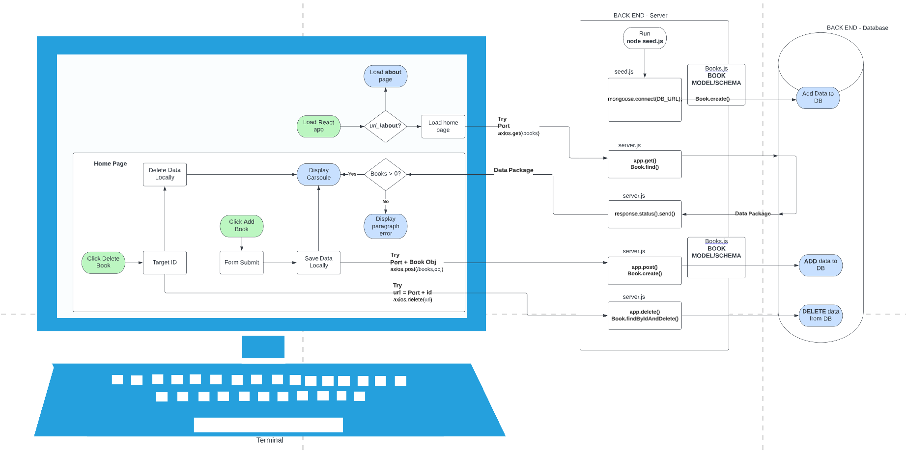

# Can of Books

**Author**: Aaron Imbrock and Cisco Sanchez
**Version**: 1.1.0 (current)

## Overview

This applications enables the user to load a series of book images and titles from a Mongo database. The application allows the user to add books and delete books from the Mongo database.

## Getting Started

Clone [can-of-books-frontend](https://github.com/aaron-imbrock/can-of-books-frontend) to your local machine. You will also need to set up [can-of-books-backend](https://github.com/aaron-imbrock/can-of-books-backend).

Set up your .env file using the .env.sample file as reference. Use your local port for the backend portion of the application.

With in the can-of-books-frontend repo in the terminal, run `npm start`. This will initiate your front end.

## Architecture

See WRRC diagram below for illustration of the communication between the difference components of the application.

## Change Log

04-24-2023 5:30pm CT - Front end repository was initialized.
04-24-2023 5:45pm CT - README.md file was initialized.
04-24-2023 9:30pm CT - Set up connection between front end and back end components of the application. Carousel react element was incorporated.
04-24-2023 10:00pm CT - Linked about me page.
04-25-2023 9:00pm CT - Added fully functioning Modal form for adding new books to database.
04-25-2023 10:00pm CT - Added function to delete individual books from the database.

## Estimates

Name of feature: Set-up Repos

Estimate of time needed to complete: 60min

Start time: 4:00pm

Finish time: 5:00pm

Actual time needed to complete: 60min

---

Name of feature: Carousel and link to Server

Estimate of time needed to complete: 60min

Start time: 8:00pm

Finish time: 9:20pm

Actual time needed to complete: 80min

---

Name of feature: About Page

Estimate of time needed to complete: 30min

Start time: 9:30pm

Finish time: 10:00pm

Actual time needed to complete: 30min

---

Name of feature: Post New Book Form

Estimate of time needed to complete: 90min

Start time: 7:00pm

Finish time: 9:00pm

Actual time needed to complete: 120min

---

Name of feature: Delete Book

Estimate of time needed to complete: 60min

Start time: 9:00pm

Finish time: 10:00pm

Actual time needed to complete: 60min

## Credit and Collaborations

Aaron Imbrock [gitHub](https://github.com/aaron-imbrock)

Cisco Sanchez [gitHub](https://github.com/c0d3cisco)

## Team Agreement

### Logistical

* What hours will you be available to communicate? 
12p-8p
* What platform will you use to communicate (ie. Slack, phone …)? 
Slack
* How often will you take breaks? 
Every hour
* What is your plan if you start to fall behind? 
Start earlier to get help from TA. Pair programming. Use demo code from class when needed to outline next steps.

### Cooperative

* Make a list of each person’s strengths. 
Cisco - Core JavaScripts methods for manipulating data, diagram wire framing. 
Aaron - Context comprehension, deployment. 
* How can you best utilize these strengths in the development of your application? 
Understand each others strengths, and through pair programming, assist each other in areas of struggle. Continue to explain concepts of strengths as needed. 
* In what areas do you each want to develop greater strength? 
Cisco - Debugging deployed applications. General react design/CSS  
Aaron - Improve time to complete project requirement relating to existing working knowledge of React. Understanding the part databases play in web development. 
* Knowing that every person in your team needs to understand the code, how do you plan to approach the day-to-day development? 
We will pair program daily, taking turns between front-end and back-end development as this will allow continuous communication of ideas and methodologies for coding.

### Conflict Resolution

* What will your team do if one person is pulling all the weight while the other person is not contributing? 
Be upfront with each other. If problems persist, contact lead instructor.
* What will your team do if one person is taking over the project and not letting the other member contribute? 
Be upfront with each other. If problems persist, contact lead instructor.
* How will you approach each other and the challenge of building an application knowing that it is impossible for two people to be at the exact same place in understanding and skill level? 
Continue to have open communication during pair programming. Encourage questions.
