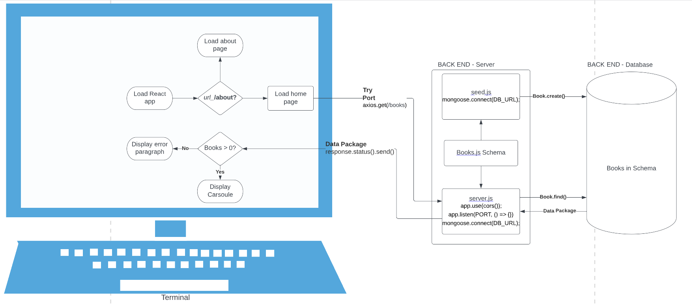

# Can of Books

**Author**: Aaron Imbrock and Cisco Sanchez
**Version**: 1.0.0

## Overview

This applications currently enables the user to load a series of book images and titles from a Mongo database.

## Getting Started

Clone [can-of-books-frontend](https://github.com/aaron-imbrock/can-of-books-frontend) to your local machine. You will also need to set up [can-of-books-backend](https://github.com/aaron-imbrock/can-of-books-backend).

Set up your .env file using the .env.sample file as reference. Use your local port for the backend portion of the application.

With in the can-of-books-frontend repo in the terminal, run `npm start`. This will initiate your front end.

## Architecture

See WRRC diagram below for illustration of the communication between the difference components of the application.

## Change Log

04-24-2023 5:30pm CT - Front end repository was initialized.
04-24-2023 5:45pm CT - README.md file was initialized.
04-24-2023 9:30pm CT - Set up connection between front end and back end components of the application. Carousel react element was incorporated.
04-24-2023 10:00pm CT - Linked about me page.

## Estimates
<!-- See below -->

## Credit and Collaborations
<!-- Give credit (and a link) to other people or resources that helped you build this application. -->